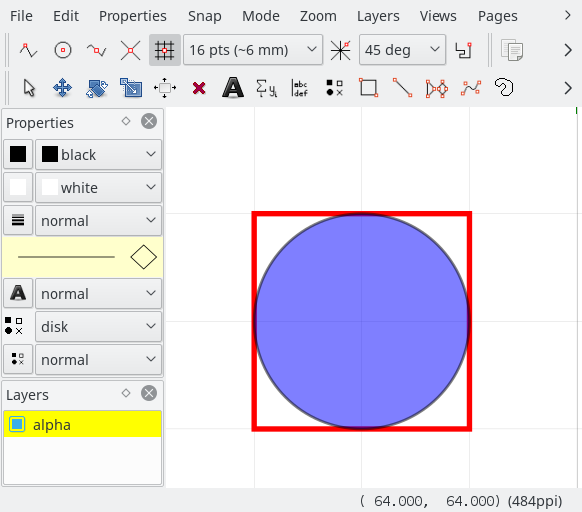

ipe2tikz
========

This is a TikZ exporter ipelet: a plugin for [Ipe](http://ipe.otfried.org/) that
exports **readable** [TikZ](https://sourceforge.net/projects/pgf/) pictures for
use in LaTeX documents.



yields

```latex
\begin{tikzpicture}[ipe import]
  \draw[red, thick]
    (16, 48) rectangle (48, 16);
  \filldraw[fill=blue, semitransparent]
    (32, 32) circle[radius=16];
\end{tikzpicture}
```

TikZ is an amazing piece of software.  To sketch a complicated shape, though,
you really want a GUI, like Ipe.  This ipelet is meant to allow you to sketch
something in Ipe, then export it into readable TikZ code that you can tweak and
perhaps use in a larger picture.  It is also quite good at exporting large and
complex Ipe files (subject to the [limitations](#limitations) below) into
standalone LaTeX documents.  Thankfully, Ipe is well-suited to generating
readable TikZ code, since they both rely on flexible symbolic style mechanisms
to specify most drawing parameters.


## Installation

1. Copy `tikz.isy` into `~/.ipe/styles` on Linux and Macs.  On Windows, I
   believe you have to use the directory containing the built-in stylesheets.
2. Copy `tikz.lua` into `~/.ipe/ipelets` on Linux and Macs, and into
   `$USERPROFILE\Ipelets` on Windows.
3. Copy `tikzlibraryipe.code.tex` somewhere LaTeX can find it, e.g. the same
   directory as the LaTeX file you're trying to compile.

I have only tested this with Ipe versions 7.2.?, on Linux and Macs.  You can
file a bug report if it doesn't work on your system or Ipe version, but I
probably won't know how to fix it unless you include a patch or pull request.


## Usage

This ipelet supports exporting the current view to a TeX file, or replacing the
selected objects by a text box containing TikZ code that reproduces those
objects.

Before you start, you should choose whether you want to primarily use TikZ's
styles or Ipe's styles.

### Using TikZ's styles

Use TikZ's styles if you want to make a sketch in Ipe, but do most of the work
in TikZ.  In this case, you want Ipe's styles to reflect TikZ's styles as
closely as possible: for instance, the pen widths should be `very thin`, `thin`,
`thick`, etc., arrows should include `Computer Modern Rightarrow` and `Stealth`,
and so on.  To do this, use `tikz.isy` *instead of* the `basic.isy` stylesheet,
and un-check *Export stylesheet* in the ipelet dialog.  Be sure to include the
TikZ libraries `arrows.meta` and `patterns`, and the provided library `ipe`
(i.e. `tikzlibraryipe.code.tex`) in your LaTeX code.  The latter defines a style `ipe
import`, which should be executed in any `tikzpicture` (or `scope`) using
exported Ipe code.

In this mode, all Ipe symbols you use must already be known to TikZ as keys.

### Using Ipe's styles

Use Ipe's styles if (a) you are more comfortable with Ipe's styles than TikZ's,
and (b) you want to do most of the drawing in Ipe, then tweak it in TikZ
afterwards.  To do this, check *Export stylesheet* in the ipelet dialog.  This
mode has the additional effect of adding an `ipe ...` prefix to many style
names: for instance, the `heavier` pen becomes `ipe pen heavier` in TikZ.  This
means that, if you have an Ipe pen width named `thick`, it will be exported to
`ipe pen thick`, and all `thick` paths will reference `ipe pen thick`.  This is
probably what you want to happen, but it does mean that you can't make a path
that uses TikZ's native `thick` style when *Export Stylesheets* is checked.

The stylesheet cascade is exported into a TikZ style called `ipe stylesheet`.
Among other things, this style contains:

+ The `ipe import` key.
+ Settings for the fill rule, line join, and line cap.
+ Settings for the pen width, dash styles, and opacity styles.
+ Settings to alias the `>` arrow tip to Ipe's `normal` arrow.

The style does *not* contain settings for marks, arrows, tilings, and some
others: see [limitations](#limitations) below.

### Exporting to a file

In this mode, the ipelet creates a file with the TikZ code necessary to
reproduce the current view on the current page.  This is suitable for
`\input`ting or copying into a LaTeX document.  

Select *Export to File* from the *TikZ Export* submenu in the ipelets menu, or
use the shortcut `Alt+T`.  A dialog appears, with the following options:

+ *Export complete document:* if this is checked, the ipelet makes a document
  that can be compiled standalone.  That is, it generates a preamble,
  `\begin{document}...\end{document}` tags, etc.  If you want to `\input` the
  output file into another LaTeX file, un-check this option.  In that case, be sure
  to set `\usetikzlibrary{arrows.meta,patterns,ipe}` somewhere.
+ *Export stylesheet:* if this is checked, the ipelet makes a TikZ version of
  the effective styles as determined by the Ipe stylesheet cascade (see 
  [above](#using-ipes-styles)), except for colors.
+ *Export colors:* if this is checked, the ipelet generates `\definecolor`
  commands for all colors defined in your Ipe stylesheets.
+ *Export scope instead of tikzpicture:* if this is checked, the generator puts
  TikZ code inside a `scope` environment instead of a `tikzpicture` environment.
  Such a file is suitable for `\input`ting directly into a `tikzpicture`
  environment, as a subpicture.  (To apply additional transformations, enclose
  the `\input` in another `scope`.)  This option is disabled if *Export complete
  document* is checked.
+ *Export grid:* if desired, you can export Ipe's grid as well.  This is useful
  for debugging the placement of objects.
+ *Output file:* this is where the TikZ code goes.

If *Export complete document* is unchecked and a coordinate system is defined,
the origin of the coordinate system becomes TikZ's origin.

### Exporting to a text box

In this mode, the user selects some number of objects, and the ipelet replaces
them by a text box containing TikZ code to reproduce those objects.  This is
useful for the following kind of workflow:

1. Create a quick picture in Ipe.
2. Convert it in-place to TikZ.
3. Edit the TikZ code in the Ipe textbox, and use the Apply button to
   immediately see your changes while editing.
4. Copy-paste the resulting TikZ picture to a LaTeX document.

For this to work, you must have Ipe 7.2.6+ installed, and you need to put
`tikzlibraryipe.code.tex` either in `~/.ipe/latexrun`, or somewhere in your
`$TEXINPUTS` path.  (I don't know where these are on Windows.)

To use, first select the objects you want to convert to TikZ.  Select *Export to
Text Object* from the *TikZ Export* submenu in the ipelets menu, or use the
shortcut `Ctrl+Shift+T`.  A dialog appears, with one option:

+ *Use TikZ styles:* this is the opposite of the *Export stylesheet* option in
  the file export dialog.  If unchecked, the ipelet will produce a TikZ style
  for Ipe's current styles.  All TikZ pictures created using *Export to Text
  Object* must use the same setting for this option.

After clicking *Ok*, the following things happen:

1. The ipelet creates an invisible layer called `_TikZ replaced`, and
   moves the selected objects to that layer.
2. The ipelet creates a style sheet called `TikZ-export`, which contains the
   necessary preamble material to compile the TikZ code in the text box.  This
   includes the TikZ style, if *Use TikZ styles* is not checked.
3. The ipelet creates a text box and populates it with the generated TikZ code.
   The position (reference point) of the text box is TikZ's origin.  By default,
   the position of the text box is the lower-left corner of the bounding box of
   the selected objects, but if you have defined a coordinate system, the
   ipelet will use the origin of the coordinate system instead.

## What it Does

The best way to get a feel for what the exporter does is to doodle in Ipe and
see what TikZ code is produced.  The ipelet code also has a lot of comments, if
you want to dig for details.  In summary:

+ Path objects are exported to usual TikZ paths, created with `\draw` or `\fill`
  or `\filldraw`.  These may contain path-to `--` commands, `arc` commands, and
  curve-to `..` commands, as well as `rectangle`, `ellipse`, and `circle`
  commands.  Composed paths are concatenated by move-to (empty) commands.
+ Text objects are exported to TikZ nodes, with the `ipe node` style.
+ Group objects are exported to TikZ scopes.  The clipping path, if it exists,
  becomes a `\clip` path in the scope.
+ Reference objects (marks) are exported to TikZ `\pic` commands.
+ If configured to do so, the stylesheet cascade is exported to a TikZ style
  called `ipe stylesheet`.

### Coordinate transformations

Objects in Ipe may have coordinate transformations applied to them.  In order to
produce readable TikZ code, these are handled as follows.

+ If the transformation is just a translation, it is absorbed into any path
  coordinates.  This is the only reasonable thing to do, since any time you
  translate an object in Ipe, you are actually updating the transformation
  matrix.
+ For path, group, and text objects, if the transformation has a nontrivial
  linear part, then try to decompose it as a rotation and a scale.  If that
  works, add `rotate=` and `scale=` options to the path.  (Marks only have
  translations in their coordinate transformations.)
+ If the decomposition didn't work, use TikZ's `cm=` option to pass the
  coordinate matrix directly.
+ In either of the above two cases, it's not always clear what point to use as
  the origin in the transformation: in Ipe, this is the origin of the paper at
  the time the object was created, which doesn't make much sense in code meant
  to be read by humans.  For path objects, the ipelet uses the first mentioned
  coordinate as the origin.  For group objects, I don't see any better origin to
  use: rotating and scaling group objects will produce somewhat funny-looking
  code, unless you are careful to create the group object near the origin.  Text
  objects have a well-defined "position", so that is used as the origin.

### Styles and options

Most options are exported symbolically, hopefully in the way one would expect.
Some are exported as numbers or RGB triples, if necessary.  If not using *Export
stylesheet*, then all exported symbols must already be known to TikZ as keys.

### The TikZ stylesheet `tikz.isy`

This file teaches Ipe to use TikZ's styles for almost everything it can draw.
Among other things, this file contains:

+ Color definitions for the built-in colors from `xcolor`.
+ The TikZ default line cap, join, and fill rules.
+ TikZ's pen widths, dash styles, and opacity styles.
+ Some of TikZ's built-in fill patterns, used for tilings.
+ Definitions of Ipe's standard mark/reference shapes.  (TikZ has no analogue
  to use instead.)
+ Definitions of some of TikZ's standard arrows, so Ipe knows how to draw them.
  Since TikZ's arrow facility is much more sophisticated than Ipe's, 
  exported TikZ arrows will not look quite the same as they did in Ipe.
+ Ipe's usual `textsize` definitions.
 
### The Ipe compatibility library `tikzlibraryipe.code.tex`

This file is the TikZ glue that complements the ipelet.  This file essentially
consists of the `ipe import` style, which contains (among other things):

+ The definitions `x=1bp` and `y=1bp`.  The basic unit in Ipe is the PDF point
  (1/72 of an inch), which in LaTeX is a "big point" (as opposed to a "Knuth
  point", which is slightly smaller).  If the exported code is to be readable,
  it had better use Ipe's basic unit.
+ The definition of the `ipe node` style, which sets the default anchor and
  scale factor, and removes inner and outer separation.
+ Arrow tip definitions for Ipe's arrows.  Ipe's arrows already look like
  certain standard TikZ arrows (`Stealth`, `Triangle`, etc.), but they behave
  rather differently with respect to line width, tip position, join style, etc.
  The arrows defined in the `ipe` library behave almost exactly like Ipe's
  arrows.
+ Definitions of Ipe's marks (`circle`, `disk`, etc.) as TikZ `pic` commands.

 
## Limitations

+ Exporting gradients and effects is not supported.  Gradients could in theory
  be exported as shades, if someone wanted to code it.  Effects probably cannot
  be implemented within PGF/TikZ.
+ Exporting bitmapped images is not supported.  You can use `\includegraphics`
  within a text object in Ipe, after putting `\usepackage{graphicx}` in the
  preamble.  The image will display in Ipe (if you have a recent enough version), 
  and it should appear after compiling the exported code.
+ Only the current page, and the current view on that page, are exported.
+ The ipelet won't export symbols (marks and arrows) from stylesheets; these
  have to be defined by hand in a TikZ style.  Note however that Ipe's standard
  marks and arrows are already defined in `tikzlibraryipe.code.tex`.
+ The ipelet won't export tilings / fill patterns from stylesheets either;
  these must also be done by hand.  It requires a bit of work to define a new
  fill pattern in TikZ.  For this reason, only the fill patterns that are
  predefined in TikZ and which can also be drawn by Ipe are defined in
  `tikz.isy`.
+ When in *Export complete document* mode, the size of the paper in LaTeX is set
  to the size of the paper in Ipe.  However, Ipe also sets PDF's `ArtBox` and
  (optionally) `CropBox` to the bounding box of the image.  The ipelet does
  not do that, as TikZ/PGF has no such facility, these being PDF-specific
  features.  The result is that your PDF reader may display a PDF saved
  directly from Ipe on a smaller canvas than when it is exported through TikZ
  first.
+ Some colors may look different after compiling LaTeX unless you put
  `\PassOptionsToPackage{rgb}{xcolor}` before `\documentclass` in your LaTeX
  file.  (This happens, for instance, when using symbolic colors defined by
  `xcolor` in cmyk, and defined in `tikz.isy` or another stylesheet in rgb.)
+ TikZ's math is done by TeX, so it suffers from some inaccuracy, and all
  numbers have to be kept rather small.  Crazy coordinate transformations may
  push the limits of what it can do.
